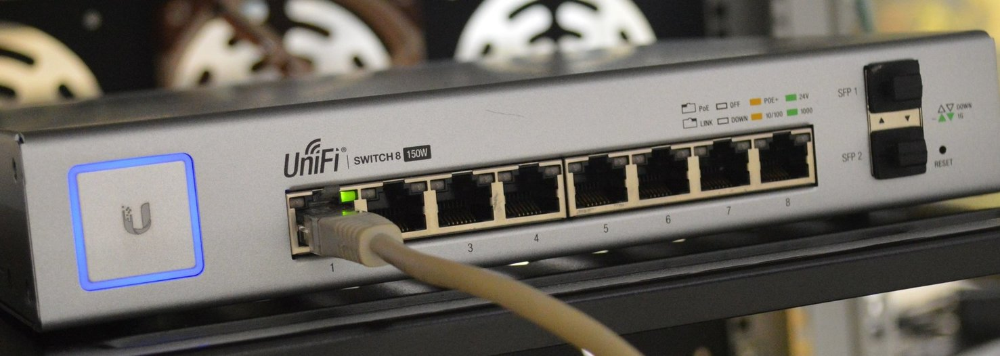
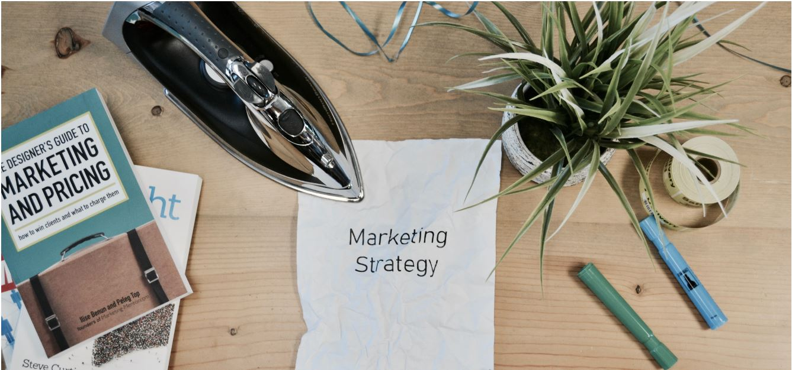

This post is a retrospective on what went well and what could have been done better with DotNet Open Source Days virtual conference. 
Though I had experience in organizing an in-person conference, when it comes to virtual event the equation is completely different. 

## What Went Well

### Bandwidth at Home

I had my own doubts when I decided to organize the conference. I had many questions for which I did not know the answers.  As mentioned in my previous posts, I decided to organize the conference on Feb-06-2020. When I mentioned that I was going to run a virtual event, I was not aware that I will be running the whole show from my home office. 

From my experience of organizing virtual meetups for JavaScript and Friends, I know that I can manage to run a virtual event for minimum of 2 hours from my home office. I have never organized a virtual event beyond 2 hours using my home bandwidth. 

> I did not have the answer to this question if my home bandwidth would support me to run a virtual event for 7 hours?

I got the answer for this question only on the day of conference. All went well. We did not face any tech issues with the event.  I have been streaming meetups through Zoom to Twitch for JavaScript and Friends. I used the same approach for DotNet Open Source Days. I decided to stream the conference to my Twitch channel through Zoom.  I could have used by Streamlabs setup to stream to my Twitch Channel, but that could have used heavy bandwidth in addition to Zoom. So, using the inbuilt Custom Live Streaming option from Zoom worked well. 

### Content by Speakers

I thank all the speakers who submitted to speak at first virtual version of DotNet Open Source Days. We had great content presented by all speakers. 

> Thanks to Chris Woodruff for accepting to deliver the keynote.

> Matt Eland presentation on overview of Scientist DotNet joining from his virtual lab.

> Rob Richardson presentations on using your technology your way and the internals of Git..

> Different design patterns for NOSQL by Ado Kukic..

> Explaining the complexity involved in Text Processing by Patrick Kelly..

All the talks were informative and shared great insights. The talks can be watched on [YouTube](https://www.youtube.com/user/baskarmib/videos?view_as=subscriber) once I get them published.

### No Zoombombing and Zoom Tech Issues

We were lucky enough that my decision to have attendees join the Zoom along with the speakers did not backfire us. We did not face any issues of Zoombombing and that is something I was worried before the day of the conference. We did not face any tech issues with Zoom getting hanged or meetings getting disconnected.

## What could have been better

### Promoting the Conference

Yes, I must admit that I did not plan well for promoting the conference. I only used LinkedIn and Twitter as my primary medium for promoting the conference. There are some plans in my mind for Version 2.0 and I think I can do better for the second version.  

### Making the Conference Interactive

We all are currently going through a situation which no one anticipated. I miss the chance of interacting with people at my in-person meetups which I attend. I could have planned some activities to keep the attendees interactive during the time when we moved from one session to another. This is something, I must plan for Version 2.0.

### Virtual Swags for Attendees

Who would not like to win some swags!! Swags are cool and specially if they are digital whether it is a subscription to a service or software. This time I did not include any swags for the conference. I hope to get in some swags for Version 2.0

I once again thank all the speakers and attendees who made the event happen. We had around 51 RSVPs for the conference and around 12 to 15 attending the sessions live. 

With better planning and execution, I am hoping to make Version 2.0 Awesome. You can get the updates on [Twitter](https://twitter.com/dotnetopensour1).

Stay safe everyone.

Image Credit in order

Photo by Thomas Jensen on Unsplash

Photo by Campaign Creators on Unsplash
