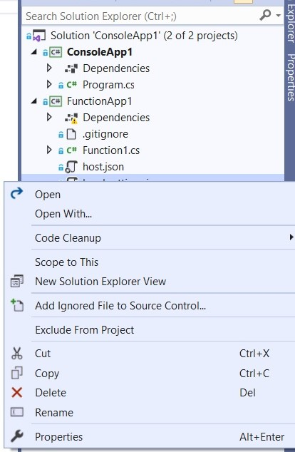

In this post I am going to show how you can add a file to source control if you have mistakenly ignored the file in your git configuration file. It is very common to mistakenly add a file or setting to gitIgnore. 

### Create your Function Project

Let us go ahead and create a Function application with trigger as Http Trigger.

> gitIgnore file is included by default in a Function project.
> Console application template does not get the gitIgnore file by default.

If you don't know why we need a gitIgnore file? 

With a gitIgnore file, we are telling Git to avoid the files which match the extensions to be omitted while committing to repository. 

### Commit Project to GitHub

Now let us go ahead and publish our project to GitHub. If we notice the local.settings.json file will be displayed with ignore symbol in Visual Studio.

### Modify gitIgnore file and add file to Solution

Now let us go ahead and remove the local.settings.json file from gitIgnore file and commit the changes back to our repository. 

If you want to add the ignored file back, you must right click on the file and select the option - "Add Ignored File to Source Control".

In my opinion we might sometime notice that the tooltip against the file displays "Ignored" without the ignored symbol. The ignore symbol gets reflected against the file once we reload the solution. 

Hope this post helped you in adding an ignored file to solution.