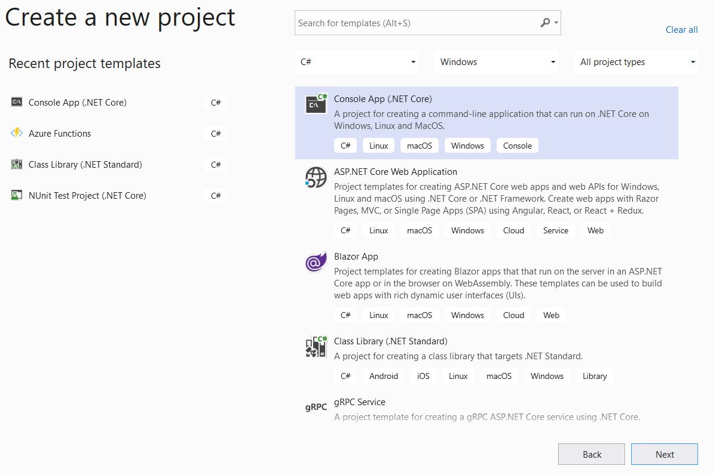
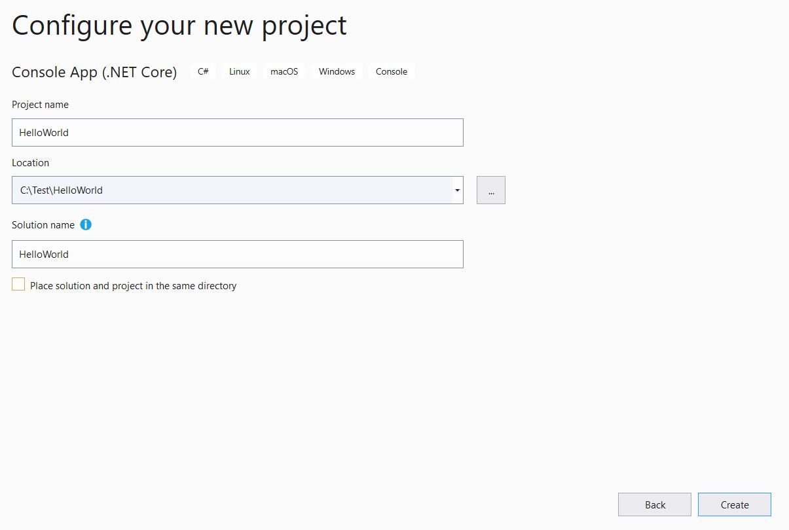
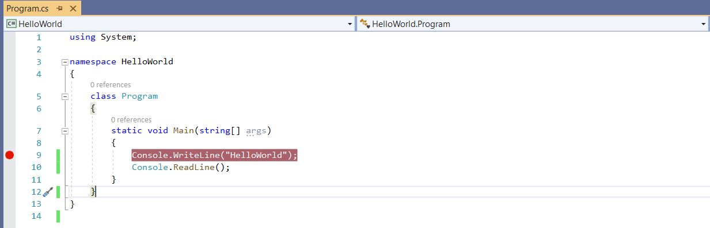
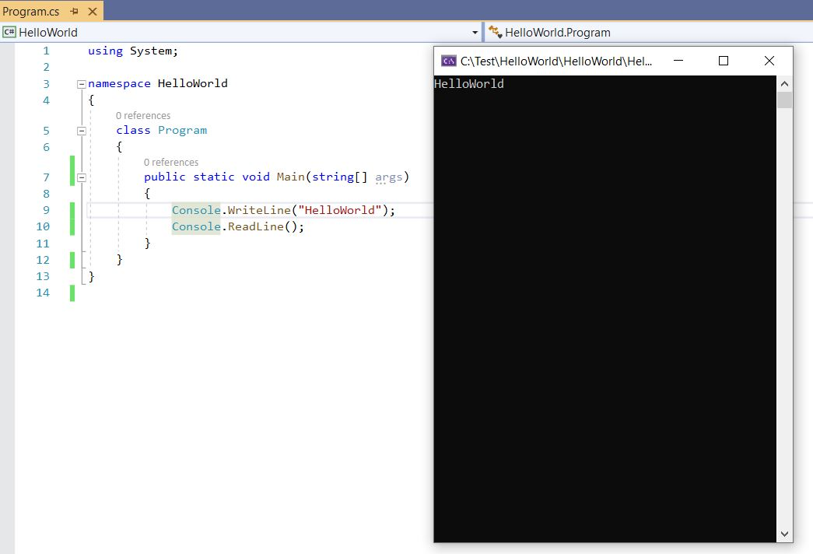

If you have not read my previous post which explained - "C# learning journey Day-1" then I suggest giving it a read before proceeding to read this post.

Getting a basic understanding of building blocks in C# is the foundation that we will use to build our skills. 
Imagine a house that is built on weak foundation? You don't know when the house will collapse or get damaged leaving the inmates of the house injured. 
In the same way continuing the learning journey without foundation will impact us more down the line.


<span>Photo by <a href="https://unsplash.com/@mirkoblicke?utm_source=unsplash&amp;utm_medium=referral&amp;utm_content=creditCopyText">Mirko Blicke</a> on <a href="https://unsplash.com/s/photos/concrete-foundation?utm_source=unsplash&amp;utm_medium=referral&amp;utm_content=creditCopyText">Unsplash</a></span>

The stronger the foundation, makes the learning process smooth.
So, if we are good with the foundation, let us go ahead and proceed further.

## Day - 2
### What applications you can build with C#?

C# can be used to develop wide variety of applications. With C# we can develop console applications, web applications, windows desktop applications, mobile applications, IOT (Internet of Things) device applications and game development using Unity and C#.
We can develop above applications using Visual Studio. 

Visual Studio Community edition is free to download and install. You can follow the instructions of the wizard to install Visual Studio.
[https://visualstudio.microsoft.com/vs/community/](https://visualstudio.microsoft.com/vs/community/)


### Excitement Begins Now


Once Visual Studio is installed without wasting time let us go ahead and create our first sample application or in other words our first Hello world application.
In order to create our first application, we will go ahead and open Visual Studio 2019 Community Edition. 

When we open the IDE (Integrated Development Environment) for the first time, it would ask us to select the language settings. 
Since we are dealing with C#, we can choose the same.

1.	In order to create an application, we must first create a solution. Solution is like a box where we place all our projects related to the application.
2.	From the pre-installed project templates select the project type as Console application.
3.	Provide a name for the Solution and Project Name and select the Create Option.
4.	You should be able to see the Hello World application.








So, what happened till now - Visual Studio created the solution and project based on our selection. 
You will find Program.cs - This is your play area where you can write your code.

```js
using System;

namespace HelloWorld
{
    class Program
    {
        static void Main(string[] args)
        {
            Console.WriteLine("Hello World!");
            Console.ReadLine();
        }
    }
}
```


### What can we understand from the above code snippet?

Every code file in C# needs a namespace. So, what is a namespace? 
In layman terms consider namespace as an identifier. For example, you can relate the namespace to your community where you live. 
Within your community there can be multiple apartments. Similarly, you can have multiple classes inside your namespace.

Every console application needs a Main method. Main is the entry point for console application. If you notice Main method will be defined as static. 
It means that we can execute the Main method without requiring an instance of the class Program.

The main method uses "void" which means the Main method does not return any value. 
Since we are not using any access modifier for the method, by default the method is considered private. In C# the default access modifier is private. 
Which means the method will not be exposed outside of the class.

In Visual Studio you can find Green - Play button, this will start the application with Debug enabled. 
You can place breakpoints like the red dot as shown in the below picture before clicking the Play button.




When we click the Play button - Visual Studio will build the application and runs the application. If the build is successful, you can see the application displaying a console window and the code execution stops 
in the breakpoint waiting for action from us. 

We can go ahead and select the Continue Option - the same Green - Play button. The code execution continues, and we can find the Console printing the output - Hello World.
Next the code executes Console.ReadLine() which would accept an input from us. We can enter any random text in Console and press the Enter key to close the console. Console.ReadLine() is useful so that we can see the output in the console. If we execute the same code again without Console.ReadLine() you can see that the console windows start and closes without showing us the output. It is because the console prints the output and does not wait and proceeds to close the application. Console is the class which is part of namespace System. This is used to handle any console-based operations.



<br></br>

> Did you get excited on seeing the output?

> I got excited the first time when I executed my console application which was written using BASIC.

### Additional Resources

You can follow through the instructions here to develop your first hello world application using C#.

[https://docs.microsoft.com/en-us/learn/modules/csharp-write-first/](https://docs.microsoft.com/en-us/learn/modules/csharp-write-first/)

Follow this resource to get more understanding on Static Classes and Static Methods.

[https://docs.microsoft.com/en-us/dotnet/csharp/programming-guide/classes-and-structs/static-classes-and-static-class-members](https://docs.microsoft.com/en-us/dotnet/csharp/programming-guide/classes-and-structs/static-classes-and-static-class-members)


To get more understanding about Solution and Projects use the below resource.

[https://docs.microsoft.com/en-us/visualstudio/get-started/tutorial-projects-solutions?view=vs-2019](https://docs.microsoft.com/en-us/visualstudio/get-started/tutorial-projects-solutions?view=vs-2019)

Resource to understand namespace and System.

[https://docs.microsoft.com/en-us/dotnet/csharp/programming-guide/namespaces/](https://docs.microsoft.com/en-us/dotnet/csharp/programming-guide/namespaces/)

[https://docs.microsoft.com/en-us/dotnet/api/system?view=dotnet-plat-ext-3.1](https://docs.microsoft.com/en-us/dotnet/api/system?view=dotnet-plat-ext-3.1)


Self-Check - At this stage you should be able to answer the below questions.

1.	What are the types of applications that can be developed using C#?
2.	What is console application?
3.	What is a Solution and what is a project?
4.	What is namespace?
5.	What is entry point for console applications?
6.	How to build and debug your application using breakpoints?
7.	What is the use of Console.WriteLine() and Console.ReadLine()?
8.	What is a Static Class?
9.	What is a Static Method?
10.	What is the default access modifier?
11.	What is the use of void ?
12.	What is the use of System?

Now you should be able to create, build and debug console applications. 
You also will be having a basic understanding of the "using" statement, the usage of static methods and return types of the methods.


