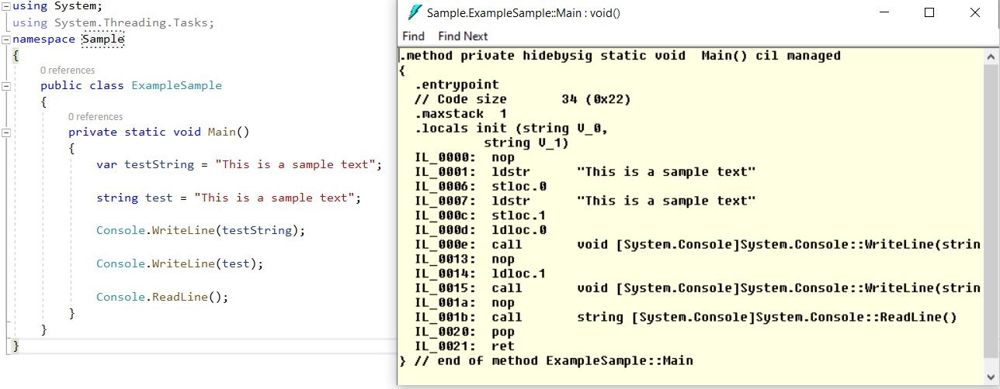

This blog post is part of Fourth C# Annual Advent organized by Matt Groves, Developer Advocate Couchbase and Microsoft MVP and Calvin Allen, Microsoft MVP. 
Thanks to Matt and Calvin for giving me an opportunity to participate again this year.

You can follow all the posts from this year [C# Advent here](https://www.csadvent.christmas/).

This post is based on a response to tweet and all the follow up conversations that happened as part of those conversations. 

https://twitter.com/baskarmib/status/1331071483611844608


> Using "var" does not make your code readable. Most common myth.

Many have already decided which camp they belong. Everyone is inclined towards the "var" camp. 
The most commonly believed myth is that using "var" makes our code not readable. 
Thanks to tooling and support in Visual Studio, now it is no longer difficult to know the type that is used by hovering over the variable. There it solves the question about readability.


```csharp
public class ExampleSample
{
private static void Main()
{
    var testString = "This is a sample text";

    string test = "This is a sample text";
}
}
```

The issue of readability is only faced when code review is not performed using Visual Studio or Visual Studio Code. 
If we use GitHub Pull request alone as a means to review code, it makes it difficult to review the code. 
So next time if you are reviewing code use Visual Studio or Visual Studio Code. 

Developer community strongly feels that using "var" helps in code refactoring. 
The argument is that using "var" we will be able to change the return type of any function without worrying where the variables are declared. 
This is a strong plus point if choosing to code using "var". Check out the medium article in Related Links for more details. 

The other myth is that using "var" involves performance issues during runtime. 
Thanks to this tweet from John A who confirmed that there is no performance degradation if we use "var", because all that needs to happen, will happen during the compile time and not runtime.

https://twitter.com/johnazariah/status/1331155914502533120


So to check this further, I went through and ran ILDASM to see if there is any difference using "var" or the "type" name explicitly. 

From the managed code we can see that, both lines look the same. 



So finally whether we use "var" or type name, it all depends on the choice that we want to make. 
If we are starting a brand new project or library there is no harm taking the "var" route. 
If it is an existing project where the team has established a practice to use the type name explicitly we can follow the same. 

Both camps are equal and there is no difference which camp do we belong as a developer. 
But using "var" has advantages during refactoring. 

We can update the tooling to use the right "var preferences" in Visual Studio and Resharper. Check the related links section for more details.

Feel free to share your thoughts through a tweet tagging me(@baskarmib) and #csadvent2020.

### Related Links
<div class="notification is-info">
<p>
<a href="https://medium.com/@antao.almada/why-i-use-var-6395ecdbe3" target="_blank" rel="noopener noreferrer">Why I use ‘var’</a>
</p>
<p>
<a href="https://resharper-support.jetbrains.com/hc/en-us/articles/207242825-Why-ReSharper-always-suggests-to-use-var-instead-of-explicit-type-usages-" target="_blank" rel="noopener noreferrer">Why ReSharper always suggests to "use var" instead of explicit type usages?</a>
</p>
<p>
<a href="https://docs.microsoft.com/en-us/dotnet/fundamentals/code-analysis/code-style-rule-options" target="_blank" rel="noopener noreferrer">How to control var preferences in Visual Studio</a>
</p>

</div>