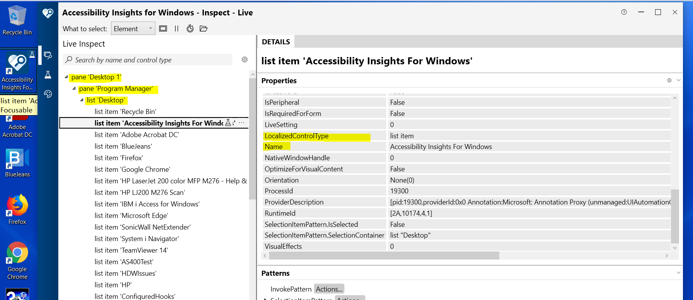

This blog post is part of Fifth C# Annual Advent organized by Matt Groves, Product Marketing Manager-Couchbase and Microsoft MVP and Calvin Allen, Microsoft MVP. Thanks to Matt and Calvin for giving me an opportunity to participate again this year.

You can follow all the posts from this year [C# Advent here.](https://www.csadvent.christmas/)

In this post, I wanted to cover some aspects of Accessibility Insights previously called Inspect and how we can develop automation solutions for Windows/Desktop Applications using dlls that support Accessibility Insights.

### What is Accessibility Insights?

Accessibility Insights is a Windows tool which can be used to check if windows/desktop applications meet accessibility requirements. Developers will be able to use the tool to find and fix accessibility issues. If you are web developer, you might be aware of the Inspect option that can be used to examine the UI of web application from the browser tools. Accessibility Insights is a similar tool that can be used to examine the UI of Desktop applications.

Accessibility Insights can be used to inspect the desktop application using two modes. One using Live Inspection Mode and other is to use FastPass. We are not going to go deep into these modes now. Using Accessibility Insights we can identify the Id Properties, Name fields and other properties that we can use to identify controls on our desktop application. 

Here is a screenshot of Desktop Pane with list of icons displayed in Accessibility Insights.



The left displays the Desktop in the form of TreeView. This TreeView is important for us to identify the location of the control in the hierarchy. 

Now it is time to write some code to access the element using C#. We will navigate the treeview and identify the “Accessibility Insights For Windows” Icon from the Desktop.

### Accessing Icons Using Code

We can use a normal Console Application. After creating a new console application, let us add references to the following dlls.

1. UiaComWrapper.dll
2. Interop.UIAutomationClient.dll

These dlls can be found from the below location.

C:\Program Files (x86)\Microsoft Visual Studio\2019\Professional\Common7\IDE\Extensions\TestPlatform

```csharp
using System;
using System.Windows.Automation;

namespace ConsoleApp3
{
    class Program
    {
        static void Main(string[] args)
        {
            Console.WriteLine("Hello World!");
            //Below Code Gets the ProcessID of Console
            Condition condition1 = new PropertyCondition(AutomationElement.ProcessIdProperty, System.Diagnostics.Process.GetCurrentProcess().Id);
            AutomationElement elm = AutomationElement.RootElement;
            //We have to avoid the console from TreeView
            Condition condition2 = new AndCondition(new Condition[] { Automation.ControlViewCondition, new NotCondition(condition1) });
            Condition condition3 = new PropertyCondition(AutomationElement.NameProperty, "Accessibility Insights For Windows");
            Condition condition4 = new AndCondition(condition2, condition3);

            //Now we are trying to walk the tree using condition 4.
            TreeWalker treeWalker = new TreeWalker(condition4);

            if(treeWalker != null)
            {
                var firstControl = treeWalker.GetFirstChild(elm);
                Console.WriteLine(firstControl.Current.Name);
            }
            
            //Below Code Gets All Items From a List Named Desktop
            Condition desktopList = new PropertyCondition(AutomationElement.NameProperty, "Desktop");

            Condition list = new AndCondition(new Condition[] { desktopList, new NotCondition(condition1) });
            treeWalker = new TreeWalker(list);

            var firstpane = treeWalker.GetFirstChild(elm);

            Condition findCondition2 = new PropertyCondition(AutomationElement.ControlTypeProperty, ControlType.ListItem);
            AutomationElementCollection items2 = firstpane.FindAll(TreeScope.Children, findCondition2);

            for (int x = 0; x < items2.Count; x++)
            {
                AutomationElement name = items2[x];
                if (!string.IsNullOrWhiteSpace(name.Current.Name))
                {
                    Console.WriteLine(name.Current.Name);
                }
            }
            Console.ReadLine();
        }
    }
}
```

Above code navigates treewalker using the Property Conditions. AutomationElement.RootElement gives the root of the treeview which is always the Desktop1. We have to navigate to required level using property conditions by ignoring the current process of console application. 

We can use the Selection Pattern on control to invoke the controls if they have selection pattern. For example below code snippet can be used to perform the action of selection.

 
```csharp
SelectionItemPattern click = (SelectionItemPattern)control.GetCurrentPattern(SelectionItemPattern.Pattern);
click.Select();
```

We can use the InvokePattern on button control to invoke the button click event using below code.

```csharp
InvokePattern close = (InvokePattern)control.GetCurrentPattern(InvokePattern.Pattern);
close.Invoke();
```

This way we can extend our console application to automate steps on desktop applications. It is always best to run only the required desktop application along with the console application and closing all other applications. This is to ensure that our treeview does not include any other applications. 

This approach is more heavy on memory and it is required to clean up our objects after usage. The above code does not include any clean up mechanism and is only used as sample for explaining the concept.

Hope you found this post insightful.

Feel free to share your thoughts through a tweet tagging me(@baskarmib) and #csadvent2021.

Thanks for reading.

### Related Links

<div class="notification is-info">
<p>
<a href="https://accessibilityinsights.io/docs/en/windows/overview/" target="_blank" rel="noopener noreferrer">More Details on Accessibility Insights can be found here</a>
</p>
</div>
