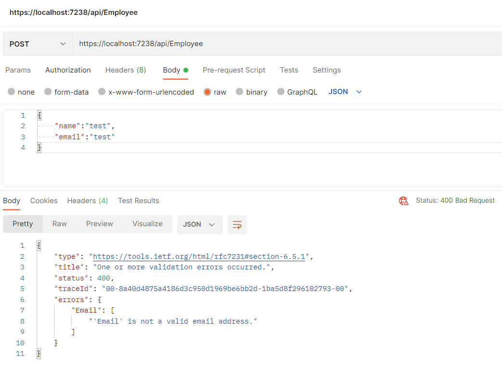

This post is part of #csadvent 2022. Thanks to Matt Groves for organizing the C# Advent again this year and providing me an opportunity to contribute. If you are looking to read and follow through all the community contributions, you can find them <a href="https://www.csadvent.christmas/" target="_blank" rel="noopener noreferrer">here</a>.

When it comes to adding validations in .Net Core APIs there are many ways we can perform validation of our API entities or request. There is not a single defined way to develop validations and in this post we are going to explore Fluent Validations and how we can use them to validate our entities in .Net Core.

## Why Choose Fluent Validations ?

Let us consider the scenario, where we have to validate our entities as part of our API. Traditionally if we have to include validations in our API we can just rely on inbuilt validation that is present in .Net Core which is driven by entities. This validation works well for required field validators. 

For example we have an Employee class, with fields Name, Email and Id as shown below.

```csharp
public class Employee
    {
     public int Id { get; set; }
     public string Name { get; set; }
     public string Email { get; set; }
    }
```

Below is a sample controller which accepts the Employee entity and saves the employee in to our List.

```csharp
    [Route("api/[controller]")]
    [ApiController]
    public class EmployeeController : ControllerBase
    {
        [HttpPost(Name = "saveemployee")]
        public IActionResult Save(Employee addEmployee)
        {
            List<Employee> emp = new List<Employee>();
            addEmployee.Id = Random.Shared.Next();
            emp.Add(addEmployee);
            return Ok();
        }
    }
```

When we test the API by removing Email, the API would return a Bad Request mentioning that Email field is required.


This works good as expected. But what will happen when we add email address with blank value?

We can see that the API is able to process our request and is able to return a valid response. 


The above is fine as long as Email is used as optional field in our database. But what if Email is specified as required field in some of our business process. Those processes will fail as it will not find a valid email address. This where Fluent Validations could help us in avoiding situations like these. 

## Explore Fluent Validations

Let us now go ahead and modify our entity and add some validators to the entity. In order to use FluentValidation we would need to install FluentValidation and FluentValidation.AspNetCore nuget packages.

```csharp
using FluentValidation;
namespace WebAPISample.Entities
{
    public class Employee
    {

     public int Id { get; set; }
     public string Name { get; set; }

     public string Email { get; set; }
    }

    public class EmployeeValidator : AbstractValidator<Employee>
    {
        public EmployeeValidator()
        {
            RuleFor(x => x.Name).NotEmpty();
            RuleFor(x => x.Email).NotEmpty().EmailAddress();
        }
    }    
}
```

After defining our validators, let us go ahead and load the validators from our assembly during Startup in Program file using AddValidatorsFromAssembly.

```csharp
using FluentValidation;
using WebAPISample.Entities;

var builder = WebApplication.CreateBuilder(args);

// Add services to the container.

builder.Services.AddControllers();
// Learn more about configuring Swagger/OpenAPI at https://aka.ms/aspnetcore/swashbuckle
builder.Services.AddEndpointsApiExplorer();
builder.Services.AddSwaggerGen();
builder.Services.AddValidatorsFromAssembly(typeof(EmployeeValidator).Assembly);
var app = builder.Build();

// Configure the HTTP request pipeline.
if (app.Environment.IsDevelopment())
{
    app.UseSwagger();
    app.UseSwaggerUI();
}

app.UseHttpsRedirection();

app.UseAuthorization();

app.MapControllers();

app.Run();
```

Let us go ahead and test our API now and see if the Validators are getting applied. 


We could see that the validator on Email is not triggered. This is the exact issue, I was facing in one of my assignments. Even though we have defined the validators in our entity class and loaded the validator assembly as part of startup, we have not yet told our API to include those validations.

Fluent Validation provides two methods of applying validations. They are Manual validation and Auto Validation. This is where the magic happens. Now let us go ahead and update our Program and add the line to include Auto Validation. This method is present as part of FluentValidation.AspNetCore

```csharp
using FluentValidation;
using FluentValidation.AspNetCore;
....
builder.Services.AddValidatorsFromAssembly(typeof(EmployeeValidator).Assembly);
builder.Services.AddFluentValidationAutoValidation();
....
app.Run();
```

Vola - Now our validations are applied and we could see that our API does not allow us to accept either a blank email address or invalid email formats.




This way we are now able to control storing invalid email address values and have better control on what values that are getting stored in our database. For more details on Manual validation and Auto validation, you can follow the Fluentvalidation documentation <a href="https://docs.fluentvalidation.net/en/latest/aspnet.html" target="_blank" rel="noopener noreferrer">here</a>. 

Using Fluent Validation, we would be able to develop conditional validators by defining ruleset accordingly. This is a great feature for developers. 

Go and give Fluent validation a try.

Let me know what is your preferred method to apply validations in your API.